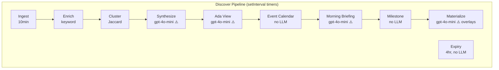
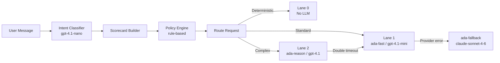
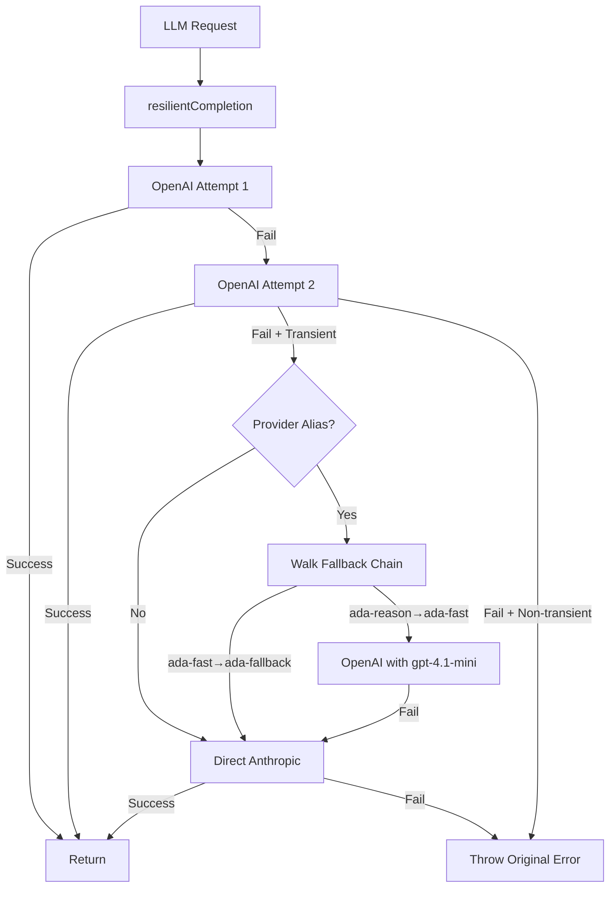

# Ada — LLM & AI Provider Audit

> **Audit date:** 2026-03-26
> **Auditor:** Automated code audit
> **Scope:** Every LLM call, AI model reference, provider integration, prompt contract, resilience path, and observability hook in the Ada codebase
> **Methodology:** Static analysis of all `server/services/`, `server/replit_integrations/`, `server/repositories/`, `shared/`, and configuration files. Every claim references exact file paths, function names, and line numbers.
> **Notation:** Items labeled **Inference** are educated deductions from code patterns. Items labeled **Not found in repo** are explicitly absent.

---

## Table of Contents

1. [Executive Summary](#1-executive-summary)
2. [Complete Model Inventory](#2-complete-model-inventory)
3. [Provider & SDK Inventory](#3-provider--sdk-inventory)
4. [End-to-End Call Flows](#4-end-to-end-call-flows)
5. [Prompt & Output Contract Audit](#5-prompt--output-contract-audit)
6. [Routing / Lane / Capability Logic](#6-routing--lane--capability-logic)
7. [Resilience / Fallback / Reliability Audit](#7-resilience--fallback--reliability-audit)
8. [Performance / Cost / Token Audit](#8-performance--cost--token-audit)
9. [Discover Pipeline Deep Audit](#9-discover-pipeline-deep-audit)
10. [Memory & Personalization Model Usage](#10-memory--personalization-model-usage)
11. [Hidden / Non-Obvious AI Usage](#11-hidden--non-obvious-ai-usage)
12. [Embeddings / Search / Retrieval Audit](#12-embeddings--search--retrieval-audit)
13. [Safety / Compliance / Guardrails Audit](#13-safety--compliance--guardrails-audit)
14. [Observability / Analytics Audit](#14-observability--analytics-audit)
15. [Technical Debt / Architecture Gaps](#15-technical-debt--architecture-gaps)
16. [Recommended Target State](#16-recommended-target-state)
17. [Concrete Refactor Plan](#17-concrete-refactor-plan)
18. [Appendix](#18-appendix)
19. [Bottom Line: What I Would Change First](#19-bottom-line-what-i-would-change-first)

---

## 1. Executive Summary

Ada is a mobile-first AI wealth copilot for GCC HNW investors. Its AI stack is built on a **4-alias model routing system** backed by OpenAI (primary) and Anthropic (fallback), orchestrated through a lane-based control plane with intent classification, policy evaluation, and multi-turn tool execution.

### Key Findings

| Area | Status | Assessment |
|------|--------|------------|
| Core chat pipeline | ✅ Healthy | Uses alias-based routing through `capabilityRegistry` + `modelRouter` with proper fallback chains via `resilientCompletion` |
| Discover pipeline | ⚠️ Tech debt | 4 workers hardcode `gpt-4o-mini` (deprecated model) bypassing the alias system |
| Embeddings / Vector search | ❌ Gap | No embedding model or vector DB; RAG is SQL-only (`to_tsvector`, Jaccard similarity) |
| Safety / Moderation | ⚠️ Partial | Regex-only guardrails and PII detection; no LLM moderation model |
| Observability | ⚠️ Partial | Good trace logging (`agent_traces`, `tool_runs`, `chat_audit_log`) but no per-model cost aggregation or dashboards |
| Scaffold code | ℹ️ Dormant | `server/replit_integrations/` contains gpt-5.1, gpt-audio, gpt-image-1 scaffolds — not mounted in Express |

### Model Count

- **4 active production models** (via capability registry)
- **1 deprecated model** hardcoded in 5 call sites (pipeline workers)
- **4 scaffold models** (not active)

---

## 2. Complete Model Inventory

### Active Models (Capability Registry)

| Alias | Actual Model | Provider | Capabilities | Context Window | Cost Tier | File | Line |
|-------|-------------|----------|-------------|----------------|-----------|------|------|
| `ada-classifier` | `gpt-4.1-nano` | OpenAI | json_mode, fast_response | 1,048,576 | low | `capabilityRegistry.ts` | 22–28 |
| `ada-fast` | `gpt-4.1-mini` | OpenAI | streaming, tool_calling, json_mode, fast_response | 1,048,576 | low | `capabilityRegistry.ts` | 29–35 |
| `ada-reason` | `gpt-4.1` | OpenAI | streaming, tool_calling, json_mode, reasoning, long_context | 1,048,576 | medium | `capabilityRegistry.ts` | 36–42 |
| `ada-fallback` | `claude-sonnet-4-6` | Anthropic | streaming, tool_calling, reasoning, long_context | 200,000 | medium | `capabilityRegistry.ts` | 43–49 |

### Hardcoded Deprecated Model

| Model String | Provider | Location | File | Line | Issue |
|-------------|----------|----------|------|------|-------|
| `gpt-4o-mini` | OpenAI | Cluster synthesis | `synthesisWorker.ts` | 139 | Bypasses alias system |
| `gpt-4o-mini` | OpenAI | Standalone article polish | `synthesisWorker.ts` | 269 | Bypasses alias system |
| `gpt-4o-mini` | OpenAI | Ada View synthesis | `adaViewWorker.ts` | 76 | Bypasses alias system |
| `gpt-4o-mini` | OpenAI | Morning briefing card | `morningBriefingWorker.ts` | 103 | Bypasses alias system |
| `gpt-4o-mini` | OpenAI | Personalization overlay | `feedMaterializer.ts` | 467 | Bypasses alias system |

### Scaffold Models (Not Active)

| Model String | Provider | Module | File | Status |
|-------------|----------|--------|------|--------|
| `gpt-5.1` | OpenAI | Chat scaffold | `replit_integrations/chat/routes.ts:85` | Not mounted in Express |
| `gpt-audio` | OpenAI | Audio scaffold | `replit_integrations/audio/client.ts:121` | Not mounted in Express |
| `gpt-4o-mini-transcribe` | OpenAI | Audio STT scaffold | `replit_integrations/audio/client.ts:247` | Not mounted in Express |
| `gpt-image-1` | OpenAI | Image generation scaffold | `replit_integrations/image/routes.ts:14` | Not mounted in Express |

---

## 3. Provider & SDK Inventory

### SDK Packages

| Package | Version | Source |
|---------|---------|--------|
| `openai` | `^6.32.0` | `package.json:46` |
| `@anthropic-ai/sdk` | `^0.80.0` | `package.json:7` |

### Client Initialization

**OpenAI Client** — `server/services/openaiClient.ts:7–10`
```typescript
export const openai = new OpenAI({
  apiKey: process.env.AI_INTEGRATIONS_OPENAI_API_KEY,
  baseURL: process.env.AI_INTEGRATIONS_OPENAI_BASE_URL,
});
```

**Anthropic Client** — `server/services/openaiClient.ts:12–15`
```typescript
const anthropicClient = new Anthropic({
  apiKey: process.env.AI_INTEGRATIONS_ANTHROPIC_API_KEY,
  baseURL: process.env.AI_INTEGRATIONS_ANTHROPIC_BASE_URL,
});
```

### Environment Variables

| Variable | Purpose | Used By |
|----------|---------|---------|
| `AI_INTEGRATIONS_OPENAI_API_KEY` | OpenAI API key | `openaiClient.ts` |
| `AI_INTEGRATIONS_OPENAI_BASE_URL` | OpenAI base URL (Replit proxy) | `openaiClient.ts` |
| `AI_INTEGRATIONS_ANTHROPIC_API_KEY` | Anthropic API key | `openaiClient.ts` |
| `AI_INTEGRATIONS_ANTHROPIC_BASE_URL` | Anthropic base URL (Replit proxy) | `openaiClient.ts` |

Both providers are managed through **Replit AI Integrations** (not raw API keys). The base URLs point to Replit's proxy endpoints.

### Provider Usage Summary

| Provider | Role | Active Call Sites |
|----------|------|-------------------|
| OpenAI | Primary for all 4 aliases | Intent classification, chat lanes 0/1/2, memory summarization, aiService, sentinel, 5 pipeline workers |
| Anthropic | Fallback only | Activated by `resilientCompletion`/`resilientStreamCompletion` when OpenAI fails with transient errors |

---

## 4. End-to-End Call Flows

### 4.1 Standard Chat (Lane 1)

```
User message → PII scan (regex) → Working memory fetch → Intent classification (ada-classifier/gpt-4.1-nano)
→ Session hydration (tenant config, user profile) → Policy evaluation (rule-based)
→ Scorecard + Route (ada-fast/gpt-4.1-mini, Lane 1) → Tool selection + prefetch
→ RAG context build (SQL) → Prompt assembly (promptBuilder) → LLM stream (resilientStreamCompletion)
→ Multi-turn tool execution (if tool_calls) → Guardrails (regex) → Response build (Zod)
→ SSE emission → Trace log → Memory persist → Episodic summarization (ada-classifier, async)
```

**File:** `agentOrchestrator.ts:189–784` (`orchestrateStream()`)

### 4.2 Complex Reasoning (Lane 2)

Same as Lane 1 but:
- Model: `ada-reason` / `gpt-4.1` (line 154)
- Temperature: 0.10 (vs 0.15 for Lane 1)
- Max output tokens: 2600 (vs 1800)
- Tool rounds: 2 (vs 1), max calls per round: 4 (vs 3)
- If both streaming attempts fail → **automatic downgrade to Lane 1** (`agentOrchestrator.ts`, documented in CHANGELOG Task #15)

### 4.3 Intent Classification

```
Message → buildClassificationPrompt(recentHistory) → resilientCompletion(gpt-4.1-nano)
→ JSON parse → Validate intent ∈ VALID_INTENTS → Continuation detection (isLikelyContinuation)
→ If "general" + continuation → inherit prior intent
→ Fallback: classifyIntentFallback() (keyword-based, priority-ordered rules)
```

**File:** `intentClassifier.ts:132–199` (`classifyIntentAsync()`)
**Model:** `resolveModel('ada-classifier')` → `gpt-4.1-nano`
**Timeout:** 4000ms, retries: 1
**Output:** `ClassifierOutput` with intent, confidence, reasoning_effort, needs_live_data, needs_tooling, mentioned_entities, followup_mode

### 4.4 Memory Summarization

```
Conversation turns → generateEpisodicSummary() → resilientCompletion(gpt-4.1-nano)
→ JSON parse → EpisodicSummary { summary, preferences, watchedEntities, unresolvedTopics, topics }
→ saveEpisodicMemory() to episodic_memories table
```

**File:** `memoryService.ts:104–156` (`generateEpisodicSummary()`)
**Model:** `resolveModel('ada-classifier')` → `gpt-4.1-nano`
**Timeout:** 5000ms, retries: 1
**Trigger:** Async fire-and-forget at end of each chat turn (`agentOrchestrator.ts:50–70`, `summarizeEpisodicAsync()`)

### 4.5 Discover Feed — Article Synthesis

```
article_clusters (SQL) → fetchArticlesForCluster() → Build synthesis prompt
→ resilientCompletion(gpt-4o-mini) → JSON parse → discover_cards INSERT
```

**File:** `synthesisWorker.ts:138–144`
**Model:** `gpt-4o-mini` (hardcoded, not alias)
**Timeout:** 20000ms
**No `providerAlias` passed** → fallback goes directly to Anthropic if OpenAI fails (no alias-chain traversal)

### 4.6 Morning Briefing Card (Discover Pipeline)

```
Overnight discover_cards (SQL) → Morning Sentinel context (via morningSentinelService.generateBriefing)
→ Build briefing prompt → resilientCompletion(gpt-4o-mini) → JSON parse → discover_cards INSERT
```

**File:** `morningBriefingWorker.ts:102–108`
**Model:** `gpt-4o-mini` (hardcoded)
**Timeout:** 15000ms

### 4.7 Morning Sentinel Streaming (Chat Feature)

```
gatherMetrics(userId) (6 parallel SQL queries) → detectAnomalies() → buildSentinelPrompt()
→ resilientStreamCompletion(MODEL, providerAlias: 'ada-fast') → SSE stream → JSON parse
→ Cache result (in-memory, 4hr TTL)
```

**File:** `morningSentinelService.ts:173–270` (`generateBriefingStream()`)
**Model:** `MODEL` = `resolveModel('ada-fast')` → `gpt-4.1-mini`
**Provider alias:** `ada-fast` (proper alias routing with fallback chain)

### 4.8 Ada View Synthesis (Weekly Editorial)

```
Top discover_cards (SQL) → Build editorial prompt → resilientCompletion(gpt-4o-mini) → JSON parse → INSERT
```

**File:** `adaViewWorker.ts:75–81`
**Model:** `gpt-4o-mini` (hardcoded)

### 4.9 Feed Materializer — Personalization Overlays

```
Top 3 scored cards per user → Per-card overlay prompt → resilientCompletion(gpt-4o-mini) → JSON parse
→ Store in personalized_overlay / personalized_why columns
```

**File:** `feedMaterializer.ts:466–472`
**Model:** `gpt-4o-mini` (hardcoded)
**Timeout:** 10000ms

### 4.10 AI JSON Generation (Generic)

```
systemPrompt + userPrompt → resilientCompletion(MODEL, providerAlias: 'ada-fast') → raw string
```

**File:** `aiService.ts:6–21` (`generateJsonCompletion()`)
**Model:** `MODEL` = `resolveModel('ada-fast')` → `gpt-4.1-mini`
**Timeout:** 10000ms, retries: 1

### 4.11 Scheduled Jobs

| Job | Interval | LLM Used | File |
|-----|----------|----------|------|
| Ingest (Finnhub fetch) | 10 min | None | `ingestWorker.ts` |
| Enrichment (taxonomy) | Per-pipeline | None (keyword-based) | `enrichmentWorker.ts` |
| Clustering | 15 min | None (Jaccard similarity) | `clusteringWorker.ts` |
| Synthesis | 15 min | `gpt-4o-mini` ×2 call sites | `synthesisWorker.ts` |
| Ada View | 6 hr | `gpt-4o-mini` | `adaViewWorker.ts` |
| Morning Briefing Card | 6 hr | `gpt-4o-mini` | `morningBriefingWorker.ts` |
| Milestone Detection | 6 hr | None (SQL threshold checks) | `milestoneWorker.ts` |
| Event Calendar | 6 hr | None (Finnhub calendar) | `eventCalendarWorker.ts` |
| Feed Materialization | 60 min | `gpt-4o-mini` (top-3 overlays) | `feedMaterializer.ts` |
| Expiry Enforcement | 4 hr | None (SQL age checks) | `expiryWorker.ts` |



---

## 5. Prompt & Output Contract Audit

### 5.1 System Prompts

| Component | Prompt Builder | Key Blocks | Output Format |
|-----------|---------------|------------|---------------|
| Chat (main) | `promptBuilder.ts:32` `buildAgentPrompt()` | Identity, Tenant Behavior, Policy, Capability, Tool Rules, Execution Boundary, Grounding Rules, Answer Contract, User Profile, Portfolio Context, Semantic Facts, Episodic Memories, Navigation Context, Classified Intent | Free-form text + `---FOLLOW_UP_QUESTIONS---` delimiter |
| Intent classifier | `intentClassifier.ts:50–98` `buildClassificationPrompt()` | 11 intent definitions, routing context (from capabilityRegistry), conversation history, follow-up resolution rules | JSON: `{intent, confidence, reasoning_effort, needs_live_data, needs_tooling, mentioned_entities, followup_mode}` |
| Episodic summary | `memoryService.ts:115–122` | Inline system prompt | JSON: `{summary, preferences, watchedEntities, unresolvedTopics, topics}` |
| Sentinel briefing | `morningSentinelService.ts:145–166` `buildSentinelPrompt()` | Inline "Return JSON only" system + structured user prompt with portfolio data | JSON: `{headline, overview, keyMovers[], risks[], actions[], benchmarkNote}` |
| Cluster synthesis | `synthesisWorker.ts` `CLUSTER_SYNTHESIS_PROMPT` | Inline template with {ARTICLES}, {THEME}, {ASSET_CLASS}, {GEOGRAPHY} | JSON: `{title, summary, detail_sections[], why_seeing_this}` |
| Standalone polish | `synthesisWorker.ts` `STANDALONE_POLISH_PROMPT` | Inline template with {TITLE}, {SUMMARY}, {PUBLISHER} | JSON: `{title, summary, why_seeing_this}` |
| Ada View | `adaViewWorker.ts` `ADA_VIEW_PROMPT` | Inline template with {CARDS} | JSON: `{title, summary, detail_sections[], why_seeing_this}` |
| Morning briefing card | `morningBriefingWorker.ts` `BRIEFING_PROMPT` | Inline template with {CARDS}, {SENTINEL_CONTEXT} | JSON: `{title, summary, detail_sections[], why_seeing_this}` |
| Personalization overlay | `feedMaterializer.ts` `PERSONALIZATION_OVERLAY_PROMPT` | Inline template with {TITLE}, {SUMMARY}, {CARD_TYPE}, {RISK_TOLERANCE}, {INTERESTS}, {GEO_FOCUS}, {TOP_ASSETS}, {GAPS} | JSON: `{personalized_overlay, personalized_why}` |

### 5.2 Output Validation

| Component | Validation Method | Strictness |
|-----------|------------------|------------|
| Chat response | `responseBuilder.ts` — Zod-validated `AdaAnswer` schema | Strict |
| Intent classifier | `JSON.parse()` + `VALID_INTENTS.includes()` check | Medium (falls back to keyword classifier on parse failure) |
| Episodic summary | `JSON.parse()` + field-level type checks | Medium (falls back to raw turn concatenation) |
| Sentinel | `JSON.parse()` → MorningSentinelResponse | Medium (cached partial on parse failure) |
| Pipeline workers | `JSON.parse()` + manual field access | Low (logs warning, continues to next item) |

### 5.3 Prompt Injection Defense

- **Input sanitization:** PII redaction via `piiDetector.ts` before any LLM call (`agentOrchestrator.ts:199–200`)
- **Output sanitization:** `guardrails.ts:11–136` — regex-based execution boundary enforcement, blocked phrase redaction, education-only mode advisory language removal, security name removal, stale data disclosure
- **System prompt protection:** Not found in repo. No explicit prompt injection defense (e.g., XML delimiters, instruction hierarchy markers)
- **Inference:** The detailed system prompt includes many behavioral constraints but does not contain anti-injection markers like `<system>` boundaries or "ignore all previous instructions" defenses

---

## 6. Routing / Lane / Capability Logic

### 6.1 Lane Architecture



### 6.2 Lane Configuration

| Lane | Label | Provider Alias | Model | Temperature | Max Tokens | Tool Rounds | Max Calls/Round |
|------|-------|---------------|-------|-------------|------------|-------------|-----------------|
| 0 | Deterministic | `ada-fast` | gpt-4.1-mini | — | 1024 | — | — |
| 1 | Standard LLM | `ada-fast` | gpt-4.1-mini | 0.15 | 1800 | 1 | 3 |
| 2 | Reasoning LLM | `ada-reason` | gpt-4.1 | 0.10 | 2600 | 2 | 4 |

**Source:** `capabilityRegistry.ts:73–103`

### 6.3 Intent → Lane Mapping

| Intent | Default Lane | Supported Lanes | Required Tools |
|--------|-------------|-----------------|----------------|
| `balance_query` | 0 | 0, 1 | portfolio_read |
| `portfolio_explain` | 1 | 0, 1, 2 | portfolio_read |
| `allocation_breakdown` | 0 | 0, 1 | portfolio_read |
| `goal_progress` | 0 | 0, 1 | portfolio_read |
| `market_context` | 1 | 1, 2 | market_read |
| `news_explain` | 1 | 1, 2 | news_read |
| `scenario_analysis` | 2 | 1, 2 | portfolio_read, workflow_light |
| `recommendation_request` | 2 | 2 | portfolio_read, health_compute |
| `execution_request` | 2 | 2 | execution_route |
| `support` | 1 | 1 | — |
| `general` | 1 | 1 | — |

**Source:** `capabilityRegistry.ts:105–194`

### 6.4 Routing Logic (`modelRouter.ts:116–178`)

1. **Deterministic check:** If intent ∈ {balance_query, allocation_breakdown, goal_progress} → Lane 0 (no LLM)
2. **Reasoning escalation:** If risk_level=high OR tool_count≥3 OR intent ∈ {scenario_analysis, recommendation_request} OR reasoning_effort=high OR policy=restricted_advisory → Lane 2
3. **Default:** Lane 1

### 6.5 Fallback Chain

| Primary Alias | Fallback Alias | Fallback Model |
|--------------|---------------|----------------|
| `ada-fast` | `ada-fallback` | claude-sonnet-4-6 |
| `ada-reason` | `ada-fast` | gpt-4.1-mini |
| `ada-fallback` | `null` | — (terminal) |
| `ada-classifier` | `null` | — (terminal, uses keyword fallback) |

**Source:** `modelRouter.ts:15–20`

---

## 7. Resilience / Fallback / Reliability Audit

### 7.1 Core Resilience Functions

| Function | File | Retry | Timeout | Fallback | Provider Alias Chain |
|----------|------|-------|---------|----------|---------------------|
| `resilientCompletion()` | `openaiClient.ts:292–360` | 2 attempts | 15s default | Anthropic via fallback chain OR direct | Yes (walks FALLBACK_CHAIN) |
| `resilientStreamCompletion()` | `openaiClient.ts:362–438` | 0 (single attempt) | 15s default | Anthropic via fallback chain OR direct | Yes |
| `withChunkTimeout()` | `openaiClient.ts:440–470` | — | 30s chunk, 120s total | Throws on timeout | — |

### 7.2 Resilience Coverage by Call Site

| Call Site | Uses `resilientCompletion`? | Passes `providerAlias`? | Has Fallback? | Issue |
|-----------|---------------------------|------------------------|---------------|-------|
| Intent classifier | ✅ | ✅ `ada-classifier` | ✅ via chain (→ null, keyword fallback) | ✅ Healthy |
| Chat Lane 1 stream | ✅ `resilientStreamCompletion` | ✅ `ada-fast` | ✅ → ada-fallback (Anthropic) | ✅ Healthy |
| Chat Lane 2 stream | ✅ `resilientStreamCompletion` | ✅ `ada-reason` | ✅ → ada-fast → ada-fallback | ✅ Healthy |
| Episodic summary | ✅ | ✅ `ada-classifier` | ✅ via chain (→ null) | ✅ Best-effort (fire-and-forget) |
| aiService | ✅ | ✅ `ada-fast` | ✅ → ada-fallback | ✅ Healthy |
| Sentinel stream | ✅ `resilientStreamCompletion` | ✅ `ada-fast` | ✅ → ada-fallback | ✅ Healthy |
| Sentinel non-stream | ✅ | ✅ `ada-fast` | ✅ → ada-fallback | ✅ Healthy |
| synthesisWorker | ✅ | ❌ No providerAlias | ⚠️ Direct Anthropic fallback only | Model bypass |
| adaViewWorker | ✅ | ❌ No providerAlias | ⚠️ Direct Anthropic fallback only | Model bypass |
| morningBriefingWorker | ✅ | ❌ No providerAlias | ⚠️ Direct Anthropic fallback only | Model bypass |
| feedMaterializer | ✅ | ❌ No providerAlias | ⚠️ Direct Anthropic fallback only | Model bypass |

### 7.3 Error Classification (`isProviderError()` — `openaiClient.ts:233–261`)

Transient errors that trigger fallback:
- HTTP status ≥ 429 or 0
- Timeout, abort, ECONNREFUSED, ECONNRESET, ENOTFOUND, socket hang up, fetch failed, network errors
- Rate limit (429), server errors (500, 502, 503, 504)

Non-transient errors throw immediately without fallback.

### 7.4 Anthropic Adapter

**Message conversion:** `extractSystemAndMessages()` (`openaiClient.ts:26–48`) — extracts system message, converts roles, maps tool results to `[Tool result]:` prefix.
**Tool conversion:** `convertToolsForAnthropic()` (`openaiClient.ts:50–61`) — maps OpenAI function definitions to Anthropic `Tool.InputSchema`.
**Response conversion:** Both non-streaming (`anthropicCompletion()`, line 63) and streaming (`anthropicStreamCompletion()`, line 125) convert Anthropic responses back to OpenAI `ChatCompletion` / `ChatCompletionChunk` format.

**Limitation:** The Anthropic adapter always uses `ANTHROPIC_FALLBACK_MODEL = 'claude-sonnet-4-6'` (line 17), ignoring the original model parameter. This is intentional — Anthropic serves as a single-model fallback tier.



---

## 8. Performance / Cost / Token Audit

### 8.1 Latency Targets

| Lane | First Token Target | Total Target | Source |
|------|-------------------|--------------|--------|
| Lane 0 | — | 800ms | `traceLogger.ts:24` |
| Lane 1 | 1800ms | 5000ms | `traceLogger.ts:25` |
| Lane 2 | 2500ms | 9000ms | `traceLogger.ts:26` |

Latency targets are checked via `checkLatencyTargets()` (`traceLogger.ts:29–54`) and deviations logged to console. **No alerting or metrics aggregation** on breaches.

### 8.2 Token Budget per Call Site

| Call Site | Max Output Tokens | Temperature | Input Estimate |
|-----------|------------------|-------------|----------------|
| Intent classifier | 200 | default (unset) | ~800–1200 (prompt + routing context) |
| Lane 1 chat | 1800 | 0.15 | Variable (prompt + context + tools) |
| Lane 2 chat | 2600 | 0.10 | Variable (larger tool set) |
| Episodic summary | 300 | 0.1 | ~1500 (transcript) |
| Sentinel briefing | 2048 | default | ~800 (portfolio data) |
| Synthesis (cluster) | 800 | 0.4 | ~1500 (articles) |
| Synthesis (standalone) | 300 | 0.3 | ~500 (single article) |
| Ada View | 800 | 0.5 | ~800 (top cards) |
| Morning briefing card | 600 | 0.4 | ~600 (cards + sentinel) |
| Personalization overlay | 200 | 0.3 | ~400 (card + profile) |
| aiService generic | 512 | default | Variable |

### 8.3 Cost Tier Mapping

| Model | OpenAI Pricing Tier | Ada Cost Tier | Primary Use |
|-------|-------------------|---------------|-------------|
| gpt-4.1-nano | Lowest | `low` | Classifier, episodic summary |
| gpt-4.1-mini | Low | `low` | Standard chat, sentinel, aiService |
| gpt-4.1 | Medium | `medium` | Reasoning queries |
| claude-sonnet-4-6 | Medium | `medium` | Fallback only |
| gpt-4o-mini | Low (deprecated) | N/A (not in registry) | Pipeline workers |

### 8.4 Token Usage Tracking

**Tracked:** `chat_audit_log.tokens_used` — logged in `memoryService.ts:226–250` (`logAudit()`)
**Not tracked:** Per-model token aggregation, per-user cost allocation, daily/monthly cost dashboards

**Inference:** Token usage is logged per-request in `chat_audit_log` but there is no materialized view or aggregation query to compute cost-per-model or cost-per-user. The `agent_traces` table stores `model_name` but not `usage.total_tokens`.

---

## 9. Discover Pipeline Deep Audit

### 9.1 Pipeline Architecture

The Discover pipeline is a 10-stage content processing system running on `setInterval` timers with concurrency locks.

**Orchestrator:** `discoverPipeline/index.ts`

| Stage | Worker | Interval | LLM? | Model |
|-------|--------|----------|------|-------|
| 1. Ingest | `ingestWorker.ts` | 10 min | No | — |
| 2. Enrich | `enrichmentWorker.ts` | Per-pipeline | No | — |
| 3. Cluster | `clusteringWorker.ts` | 15 min | No | — |
| 4. Synthesize | `synthesisWorker.ts` | 15 min | **Yes** | `gpt-4o-mini` ⚠️ |
| 5. Ada View | `adaViewWorker.ts` | 6 hr | **Yes** | `gpt-4o-mini` ⚠️ |
| 6. Event Calendar | `eventCalendarWorker.ts` | 6 hr | No | — |
| 7. Morning Briefing | `morningBriefingWorker.ts` | 6 hr | **Yes** | `gpt-4o-mini` ⚠️ |
| 8. Milestone | `milestoneWorker.ts` | 6 hr | No | — |
| 9. Expiry | `expiryWorker.ts` | 4 hr | No | — |
| 10. Materialize | `feedMaterializer.ts` | 60 min | **Yes** (top-3 overlays) | `gpt-4o-mini` ⚠️ |

### 9.2 LLM Call Details per Worker

**synthesisWorker.ts:**
- **Cluster synthesis** (line 138): `resilientCompletion({ model: 'gpt-4o-mini', ... }, { timeoutMs: 20000 })`
  - Input: Article cluster text, theme, asset class, geography
  - Output: JSON with title, summary, detail_sections, why_seeing_this
  - No `providerAlias` → fallback goes directly to Anthropic
- **Standalone polish** (line 268): `resilientCompletion({ model: 'gpt-4o-mini', ... }, { timeoutMs: 10000 })`
  - Input: Single article title, summary, publisher
  - Output: JSON with polished title, summary, why_seeing_this

**adaViewWorker.ts:**
- **Editorial synthesis** (line 75): `resilientCompletion({ model: 'gpt-4o-mini', ... }, { timeoutMs: 20000 })`
  - Input: Top discover cards summary text
  - Output: JSON with title, summary, detail_sections, why_seeing_this

**morningBriefingWorker.ts:**
- **Morning card** (line 102): `resilientCompletion({ model: 'gpt-4o-mini', ... }, { timeoutMs: 15000 })`
  - Input: Overnight cards + sentinel context
  - Output: JSON with title, summary, detail_sections, why_seeing_this

**feedMaterializer.ts:**
- **Personalization overlay** (line 466): `resilientCompletion({ model: 'gpt-4o-mini', ... }, { timeoutMs: 10000 })`
  - Input: Card title/summary + user profile (risk_tolerance, interests, geo_focus, top_assets, allocation_gaps)
  - Output: JSON with personalized_overlay, personalized_why
  - Called for top 3 cards per user per materialization cycle

### 9.3 Non-LLM Intelligence

| Stage | Technique | File |
|-------|-----------|------|
| Enrichment | 12-category keyword taxonomy matching | `enrichmentWorker.ts:4–17` |
| Enrichment | Sentiment scoring (positive/negative keyword lists) | `enrichmentWorker.ts:19–20` |
| Enrichment | Importance scoring (tag count, ticker count, recency, breaking/exclusive keywords) | `enrichmentWorker.ts:46–67` |
| Enrichment | MD5-based deduplication | `enrichmentWorker.ts:69–72` |
| Clustering | Jaccard similarity on feature sets (threshold: 0.25) | `clusteringWorker.ts:15–19` |
| Clustering | Deterministic fingerprinting (prevents duplicate clusters) | `clusteringWorker.ts` |
| Materialization | Weighted scoring (portfolio relevance 30%, allocation gap 20%, suitability 15%, geo 10%, importance 10%, freshness 10%, novelty 5%) | `feedMaterializer.ts` |
| Materialization | Composition guardrails (max 2 per asset class, max 1 per theme in top 5, min 1 GCC card) | `feedMaterializer.ts` |
| Materialization | Engagement re-ranking (+10% boost per shared tag with tapped cards, -20% penalty per dismissed) | `feedMaterializer.ts` |

### 9.4 Card Types (11 total)

| Card Type | LLM-Generated? | Source |
|-----------|----------------|--------|
| `portfolio_impact` | Yes (synthesis) | Cluster synthesis |
| `trend_brief` | Yes (synthesis) | Cluster synthesis |
| `market_pulse` | Yes (synthesis/polish) | Standalone or cluster synthesis |
| `explainer` | No (editorial seed) | seed.sql |
| `wealth_planning` | No (editorial seed) | seed.sql |
| `allocation_gap` | No (editorial seed) | seed.sql |
| `event_calendar` | No (Finnhub calendar) | eventCalendarWorker.ts |
| `ada_view` | Yes (Ada View worker) | adaViewWorker.ts |
| `product_opportunity` | No (editorial seed) | seed.sql |
| `morning_briefing` | Yes (morning briefing worker) | morningBriefingWorker.ts |
| `milestone` | No (SQL threshold detection) | milestoneWorker.ts |

---

## 10. Memory & Personalization Model Usage

### 10.1 Memory Architecture (3 Tiers)

| Tier | Storage | LLM Used? | Model | File |
|------|---------|-----------|-------|------|
| Working Memory | `working_memory` table + in-memory Map | No | — | `memoryService.ts:18–64` |
| Episodic Memory | `episodic_memories` table | **Yes** (summarization) | gpt-4.1-nano (`ada-classifier`) | `memoryService.ts:104–156` |
| Semantic Facts | `semantic_facts` table | No (extracted elsewhere) | — | `memoryService.ts:175–224` |

### 10.2 Working Memory

- **Cap:** 20 messages per thread (`memoryService.ts:44`)
- **Persistence:** Async write-through to `working_memory` table
- **Eviction:** FIFO sliding window (oldest messages dropped)
- **No LLM involvement**

### 10.3 Episodic Memory

- **Trigger:** Async fire-and-forget after each chat turn (`summarizeEpisodicAsync()`, `agentOrchestrator.ts:50–70`)
- **Model:** `resolveModel('ada-classifier')` → `gpt-4.1-nano`
- **Prompt:** Inline system prompt requesting JSON with summary, preferences, watchedEntities, unresolvedTopics, topics
- **Fallback:** On LLM failure → raw turn concatenation + keyword-based topic extraction (`extractFallbackTopics()`, line 158)
- **Eviction:** **Not found in repo** — episodic memories grow unbounded (ISS-009)

### 10.4 Semantic Facts

- **Storage:** `semantic_facts` table with `fact`, `category`, `source_thread_id`
- **Search:** PostgreSQL `to_tsvector('english', fact || ' ' || category)` full-text search with `ts_rank_cd` ranking (`memoryService.ts:186–195`)
- **No embedding model** — text search is keyword-based via PostgreSQL FTS
- **Injection:** Via `saveSemanticFact()` (`memoryService.ts:212–224`) — **Inference:** called from the orchestrator when the LLM extracts preferences/facts (exact injection point not found in a single grep, likely in response post-processing)

### 10.5 Chat Audit Log

- **Table:** `chat_audit_log`
- **Fields:** user_id, thread_id, action, intent, pii_detected, input_preview, model, tokens_used
- **LLM involvement:** None (logging only)
- **Source:** `memoryService.ts:226–250`

---

## 11. Hidden / Non-Obvious AI Usage

| # | What | Where | How | Obvious? |
|---|------|-------|-----|----------|
| 1 | Continuation detection post-classification override | `intentClassifier.ts:178–192` | After LLM returns intent, if message is a likely continuation (≤6 words + pattern match) AND LLM returned "general", overrides to prior turn's intent | Non-obvious |
| 2 | Lane 0 entity-query upgrade | `agentOrchestrator.ts:292–307` | If route is Lane 0 but message contains entity keywords (specific stocks, sectors, geographies), upgrades to Lane 1 to invoke LLM | Non-obvious |
| 3 | Async episodic summarization | `agentOrchestrator.ts:50–70` | Every chat turn triggers fire-and-forget LLM call for memory summarization | Non-obvious (no user-visible output) |
| 4 | Classifier context injection | `capabilityRegistry.ts:217–251` `getClassifierContext()` | Dynamically generates routing context (lanes, intents, tools, profiles) injected into the classification prompt | Non-obvious |
| 5 | Lane 2 → Lane 1 downgrade | Agent orchestrator | When both Lane 2 streaming attempts fail (timeout), automatically downgrades to Lane 1 for degraded response | Non-obvious |
| 6 | Scaffold code in replit_integrations | `server/replit_integrations/` | 4 modules (chat, audio, image, batch) with model references (gpt-5.1, gpt-audio, gpt-image-1) — not mounted in Express, excluded from tsconfig | Hidden (could be accidentally activated) |
| 7 | Feed personalization LLM overlay | `feedMaterializer.ts:440–487` | Top 3 For You cards get GPT-generated personalized text overlay connecting card to user's portfolio | Semi-hidden (runs in background pipeline) |

---

## 12. Embeddings / Search / Retrieval Audit

### 12.1 Current State: No Embedding Model

**No embedding model, no vector database, no semantic similarity search.** All retrieval is SQL-based.

### 12.2 Search Mechanisms

| Component | Technique | File |
|-----------|-----------|------|
| Semantic facts retrieval | PostgreSQL `to_tsvector` / `to_tsquery` with `ts_rank_cd` | `memoryService.ts:175–209` |
| RAG context building | SQL prefetch matrix (intent → bundles → parallel queries) | `ragService.ts:15–56` |
| Article clustering | Jaccard similarity on feature sets | `clusteringWorker.ts:15–19` |
| Article deduplication | MD5 hash on normalized title+summary | `enrichmentWorker.ts:69–72` |
| Enrichment taxonomy | Keyword matching against 12-category dictionary | `enrichmentWorker.ts:4–17` |
| Sentiment analysis | Positive/negative keyword counting | `enrichmentWorker.ts:19–44` |

### 12.3 RAG Architecture

The "RAG" system (`ragService.ts`) is not retrieval-augmented generation in the traditional sense. It is a **deterministic SQL prefetch system** that:

1. Maps intent to bundle set via `INTENT_PREFETCH_MATRIX` (line 15–27)
2. Fetches relevant portfolio data in parallel (holdings, allocations, goals, accounts, transactions)
3. Concatenates results into `PortfolioContext` string
4. Injects into system prompt via `promptBuilder.ts:48–49`

**No embedding, no vector similarity, no semantic search over documents.**

### 12.4 Gap Assessment

| Capability | Status | Impact |
|------------|--------|--------|
| Semantic document search | ❌ Not implemented | Cannot search across historical conversations or documents by meaning |
| Embedding-based fact retrieval | ❌ Not implemented | Semantic facts use keyword FTS (misses synonyms, paraphrases) |
| Embedding-based clustering | ❌ Not implemented | Article clustering uses Jaccard on keyword features (misses semantic similarity) |
| Vector database | ❌ Not present | No pgvector extension, no external vector DB |
| Embedding model | ❌ Not configured | No `text-embedding-*` model in use |

---

## 13. Safety / Compliance / Guardrails Audit

### 13.1 Safety Stack

| Layer | Implementation | LLM Used? | File |
|-------|---------------|-----------|------|
| PII Detection | 6 regex patterns (email, phone, SSN, credit card, passport, IBAN) | No | `piiDetector.ts:1–33` |
| Input Sanitization | PII redaction before LLM call | No | `agentOrchestrator.ts:199–200` |
| Policy Evaluation | Rule-based (tenant config + intent + risk profile) | No | `policyEngine.ts:16–37` |
| Execution Boundary | System prompt instructions + regex post-processing | No (regex) | `guardrails.ts:30–51`, `promptBuilder.ts:177–188` |
| Output Guardrails | Blocked phrase redaction, advisory language removal, security name filtering, stale data disclosure, citation checking | No (regex) | `guardrails.ts:11–136` |
| Disclosures | Rule-based disclosure injection (UAE, education-only, advisor review) | No | `policyEngine.ts:113–133` |

### 13.2 No AI Moderation Model

**Not found in repo:** No OpenAI Moderation API call, no Anthropic content filter, no LLM-based safety classifier. All safety enforcement is regex-based.

### 13.3 PII Handling Gap (ISS-001)

- **Detection:** ✅ `scanForPii()` catches email, phone, SSN, credit card, passport, IBAN
- **Redaction before LLM:** ✅ `agentOrchestrator.ts:199` sanitizes before sending to model
- **Raw storage:** ⚠️ Original unredacted message persisted to `chat_messages` table (`contentRepo.insertChatMessage()`, line 284)
- **No encryption at rest**
- **No retention policy**

### 13.4 Execution Boundary Enforcement (Multi-Layer)

1. **System prompt** (`promptBuilder.ts:177–188`): Explicit "NEVER" instructions about execution
2. **Regex guardrails** (`guardrails.ts:30–51`): 7 regex patterns + 1 hard check replacing execution-claiming language
3. **Policy engine** (`policyEngine.ts:92–98`): `execution_request` intent → require_human_review=true
4. **RM handoff** (`rmHandoffService.ts`): Routes to advisor via queue, webhook, or rejection
5. **Tool-level** (`toolRegistry.ts`): `route_to_advisor` tool called by LLM when user confirms

### 13.5 Compliance Features

| Feature | Status |
|---------|--------|
| UAE/GCC jurisdiction disclosures | ✅ Automatic (policyEngine.ts:122–126) |
| Education-only mode | ✅ Advisory language stripped (guardrails.ts:53–66) |
| Security naming restriction | ✅ Per-tenant `can_name_securities` flag (guardrails.ts:68–77) |
| Advisor handoff requirement | ✅ For execution + recommendations (policyEngine.ts:87–111) |
| Data freshness disclosure | ✅ Stale data warning appended (guardrails.ts:79–95) |
| Blocked phrase filtering | ✅ Per-tenant blocked_phrases (guardrails.ts:21–28) |

---

## 14. Observability / Analytics Audit

### 14.1 Trace Tables

| Table | Purpose | Key Fields | Source |
|-------|---------|------------|--------|
| `agent_traces` | Full pipeline trace per chat turn | conversation_id, message_id, tenant_id, user_id, intent_classification, policy_decision (JSON), model_name, reasoning_effort, tool_set_exposed, tool_calls_made (JSON), final_answer (JSON), response_time_ms, step_timings (JSON), guardrail_interventions (JSON), escalation_decisions (JSON) | `agentRepository.ts:98–119` |
| `tool_runs` | Per-tool execution log | tool_name, inputs (JSON), outputs (JSON), latency_ms, status, source_provider, conversation_id, message_id, user_id | `agentRepository.ts:76–96` |
| `policy_decisions` | Policy evaluation log | tenant_id, user_id, request_type, decision (JSON) | `agentRepository.ts` |
| `chat_audit_log` | Audit trail | user_id, thread_id, action, intent, pii_detected, input_preview, model, tokens_used | `memoryService.ts:226–250` |

### 14.2 Step Timings Tracked

| Timing | Measured? | Source |
|--------|-----------|--------|
| `session_hydrate_ms` | ✅ | `agentOrchestrator.ts:225–237` |
| `intent_classification_ms` | ✅ | `agentOrchestrator.ts:218–220` |
| `policy_evaluation_ms` | ✅ | `agentOrchestrator.ts:250–253` |
| `tool_execution_ms` | ✅ | `agentOrchestrator.ts` (tool loop) |
| `llm_generation_ms` | ✅ | `agentOrchestrator.ts` (stream timing) |
| `llm_first_token_ms` | ✅ | `agentOrchestrator.ts` (first chunk timing) |
| `post_checks_ms` | ✅ | `agentOrchestrator.ts` (guardrails) |
| `total_ms` | ✅ | `agentOrchestrator.ts` (end-to-end) |

### 14.3 What's Missing

| Gap | Impact |
|-----|--------|
| No per-model cost aggregation | Cannot compute daily/monthly LLM spend per model |
| No dashboard / UI for traces | Traces persist to DB but no visualization |
| No alerting on latency breaches | `checkLatencyTargets()` logs to console only |
| No token usage aggregation | `chat_audit_log.tokens_used` logged but not summed per model |
| Pipeline worker LLM calls not traced | Pipeline synthesis/overlay calls not logged to `agent_traces` |
| No provider health API exposure | Provider health tracking runs internally (`ISS-017`) but no endpoint |
| Console.log-based logging | No structured logger (winston, pino, etc.) — all `console.log/warn/error` |

### 14.4 Provider Fallback Logging

`logProviderFallback()` (`traceLogger.ts:56–71`) logs to console:
```
[ProviderFallback] %s → %s | reason=%s | cost=%dms | lane=%s
```
**Not persisted to database.** Lost on server restart.

---

## 15. Technical Debt / Architecture Gaps

### 15.1 Critical Tech Debt

| # | Issue | Severity | Impact | Files |
|---|-------|----------|--------|-------|
| TD-001 | Pipeline workers hardcode `gpt-4o-mini` | High | Bypasses model routing, uses deprecated model, no alias-chain fallback | `synthesisWorker.ts:139,269`, `adaViewWorker.ts:76`, `morningBriefingWorker.ts:103`, `feedMaterializer.ts:467` |
| TD-002 | Pipeline workers don't pass `providerAlias` | High | When OpenAI fails, fallback goes directly to Anthropic (skips alias chain), no model-specific routing | Same files as TD-001 |
| TD-003 | No embedding model / vector DB | High | Semantic facts search is keyword-only, article clustering misses semantic similarity, no RAG over documents | `memoryService.ts`, `ragService.ts`, `clusteringWorker.ts` |
| TD-004 | PII stored unencrypted (ISS-001) | High | Regulatory risk for GCC data protection | `chat_messages` table |
| TD-005 | No AI moderation model | Medium | Regex guardrails can miss novel attack patterns | `guardrails.ts`, `piiDetector.ts` |

### 15.2 Architecture Gaps

| # | Gap | Impact |
|---|-----|--------|
| AG-001 | No prompt injection defense | System prompt has no boundary markers or injection-resistant structure |
| AG-002 | No cost monitoring / budget caps | LLM calls have no per-user or per-tenant cost limits |
| AG-003 | No structured logging | All logging is `console.log` — not parseable, not aggregatable |
| AG-004 | Episodic memory grows unbounded (ISS-009) | No TTL or pruning — DB size grows linearly with conversations |
| AG-005 | Sentinel cache is in-memory only (ISS-016) | Resets on restart, per-instance in multi-node |
| AG-006 | Scaffold code could be accidentally activated | `replit_integrations/` modules exist with model references but no Express mount |
| AG-007 | Morning briefing not timezone-aware (ISS-023) | 6-hour interval not aligned to user's local 8 AM |
| AG-008 | No streaming fallback for pipeline workers | Workers use `resilientCompletion` (non-streaming) but have no Lane downgrade logic |
| AG-009 | Provider fallback events not persisted | `logProviderFallback()` logs to console only |

### 15.3 Model Version Currency

| Model | Status | Recommendation |
|-------|--------|----------------|
| `gpt-4.1-nano` | ✅ Current | Keep |
| `gpt-4.1-mini` | ✅ Current | Keep |
| `gpt-4.1` | ✅ Current | Keep |
| `claude-sonnet-4-6` | ✅ Current | Keep |
| `gpt-4o-mini` | ⚠️ Deprecated | Replace with `gpt-4.1-mini` via alias system |
| `gpt-5.1` | ℹ️ Scaffold only | Not active — evaluate when needed |
| `gpt-audio` | ℹ️ Scaffold only | Not active — evaluate for BL-022 (Voice Interface) |
| `gpt-image-1` | ℹ️ Scaffold only | Not active — no current use case |

---

## 16. Recommended Target State

### 16.1 Model Routing (Target)

All LLM call sites should route through the alias system:

```
Call Site → resolveModel(alias) → REGISTRY[alias].model → resilientCompletion(model, { providerAlias: alias })
```

No raw model strings anywhere in the codebase.

### 16.2 Embedding Layer (Target)

```
User query → text-embedding-3-small → pgvector similarity search → Top-K context
Semantic facts → embedding on save → vector index for retrieval
Article clustering → embedding-based similarity (replace Jaccard)
```

### 16.3 Safety Stack (Target)

```
User input → PII detection (regex) → Content moderation (LLM or API) → LLM call
LLM output → Guardrails (regex + LLM-based) → Output moderation → Disclosure injection → User
```

### 16.4 Observability (Target)

```
Every LLM call → Structured log (model, tokens, latency, cost) → Time-series DB → Dashboard + Alerts
Provider fallbacks → Persisted events → SLA monitoring
Latency breaches → Alerting (not just console.log)
```

---

## 17. Concrete Refactor Plan

### 17.1 Quick Wins (< 1 day each)

| # | Task | Effort | Impact | Files to Change |
|---|------|--------|--------|-----------------|
| QW-001 | Replace `gpt-4o-mini` with `resolveModel('ada-fast')` in all 5 pipeline call sites | 30 min | High — fixes deprecated model, enables alias routing | `synthesisWorker.ts`, `adaViewWorker.ts`, `morningBriefingWorker.ts`, `feedMaterializer.ts` |
| QW-002 | Add `providerAlias: 'ada-fast'` to all pipeline `resilientCompletion()` options | 15 min | High — enables alias-chain fallback for pipeline | Same 4 files |
| QW-003 | Persist provider fallback events to `agent_traces` or new table | 2 hr | Medium — enables fallback frequency analysis | `traceLogger.ts`, `openaiClient.ts` |
| QW-004 | Add token usage to `agent_traces` table | 1 hr | Medium — enables per-model cost analysis | `traceLogger.ts`, `agentRepository.ts` |
| QW-005 | Delete or .gitignore `server/replit_integrations/` | 15 min | Low — removes confusion from scaffold code | `server/replit_integrations/` |

### 17.2 Short-Term (1–3 days)

| # | Task | Effort | Impact |
|---|------|--------|--------|
| ST-001 | Add structured logging (pino/winston) replacing console.log | 2 days | High — enables log aggregation, search, alerting |
| ST-002 | Build simple trace dashboard (query agent_traces + tool_runs) | 1 day | Medium — enables pipeline debugging and latency analysis |
| ST-003 | Add per-model cost aggregation query/view | 4 hr | Medium — enables LLM spend monitoring |
| ST-004 | Add prompt injection defense (system message boundaries, input validation) | 1 day | High — security improvement |
| ST-005 | Add pipeline worker LLM calls to trace logging | 4 hr | Medium — closes observability gap for async workers |

### 17.3 Medium-Term (1 week)

| # | Task | Effort | Impact |
|---|------|--------|--------|
| MT-001 | Integrate OpenAI Moderation API for input/output safety | 3 days | High — catches adversarial inputs regex misses |
| MT-002 | Add pgvector extension + text-embedding-3-small for semantic facts | 5 days | High — transforms semantic search quality |
| MT-003 | Implement episodic memory eviction policy (TTL + max count) | 2 days | Medium — prevents unbounded DB growth |
| MT-004 | Add per-tenant / per-user LLM cost budgets with alerts | 3 days | High — cost protection |
| MT-005 | Encrypt PII at rest in chat_messages (AES-256) | 3 days | High — regulatory compliance |

### 17.4 Architectural (Multi-week)

| # | Task | Effort | Impact |
|---|------|--------|--------|
| AR-001 | Embedding-based RAG pipeline (replace SQL prefetch with vector retrieval) | 2 weeks | Transformative — enables semantic document search |
| AR-002 | Embedding-based article clustering (replace Jaccard with cosine similarity) | 1 week | High — significantly better cluster quality |
| AR-003 | Real-time cost dashboard with per-model, per-user, per-tenant breakdown | 1 week | High — operational visibility |
| AR-004 | Multi-provider routing with latency-based selection (not just failover) | 2 weeks | Medium — cost optimization + latency improvement |
| AR-005 | Voice interface integration (activate gpt-audio scaffold) | 2 weeks | Feature expansion (BL-022) |

---

## 18. Appendix

### 18.1 All Model String References in Codebase

```
server/services/capabilityRegistry.ts:24:    model: 'gpt-4.1-nano',
server/services/capabilityRegistry.ts:31:    model: 'gpt-4.1-mini',
server/services/capabilityRegistry.ts:38:    model: 'gpt-4.1',
server/services/capabilityRegistry.ts:45:    model: 'claude-sonnet-4-6',
server/services/modelRouter.ts:9:  'ada-classifier': 'gpt-4.1-nano',
server/services/modelRouter.ts:10:  'ada-fast': 'gpt-4.1-mini',
server/services/modelRouter.ts:11:  'ada-reason': 'gpt-4.1',
server/services/modelRouter.ts:12:  'ada-fallback': 'claude-sonnet-4-6',
server/services/openaiClient.ts:17:const ANTHROPIC_FALLBACK_MODEL = 'claude-sonnet-4-6';
server/services/discoverPipeline/synthesisWorker.ts:139:      model: 'gpt-4o-mini',
server/services/discoverPipeline/synthesisWorker.ts:269:      model: 'gpt-4o-mini',
server/services/discoverPipeline/adaViewWorker.ts:76:      model: 'gpt-4o-mini',
server/services/discoverPipeline/morningBriefingWorker.ts:103:      model: 'gpt-4o-mini',
server/services/discoverPipeline/feedMaterializer.ts:467:        model: 'gpt-4o-mini',
server/replit_integrations/chat/routes.ts:85:        model: "gpt-5.1",
server/replit_integrations/audio/client.ts:121:    model: "gpt-audio",
server/replit_integrations/audio/client.ts:157:    model: "gpt-audio",
server/replit_integrations/audio/client.ts:193:    model: "gpt-audio",
server/replit_integrations/audio/client.ts:215:    model: "gpt-audio",
server/replit_integrations/audio/client.ts:247:    model: "gpt-4o-mini-transcribe",
server/replit_integrations/audio/client.ts:263:    model: "gpt-4o-mini-transcribe",
server/replit_integrations/audio/routes.ts:98:        model: "gpt-audio",
server/replit_integrations/image/routes.ts:14:        model: "gpt-image-1",
server/replit_integrations/image/client.ts:19:    model: "gpt-image-1",
server/replit_integrations/image/client.ts:45:    model: "gpt-image-1",
```

### 18.2 Environment Variables (AI-Related)

| Variable | Required | Purpose |
|----------|----------|---------|
| `AI_INTEGRATIONS_OPENAI_API_KEY` | Yes | OpenAI API authentication |
| `AI_INTEGRATIONS_OPENAI_BASE_URL` | Yes | OpenAI API endpoint (Replit proxy) |
| `AI_INTEGRATIONS_ANTHROPIC_API_KEY` | Yes | Anthropic API authentication |
| `AI_INTEGRATIONS_ANTHROPIC_BASE_URL` | Yes | Anthropic API endpoint (Replit proxy) |
| `FINNHUB_API_KEY` | Yes | Finnhub market data + news (pipeline ingest) |
| `FRED_API_KEY` | Yes | FRED macro economic data |

### 18.3 AI-Related NPM Packages

| Package | Version | Purpose |
|---------|---------|---------|
| `openai` | ^6.32.0 | OpenAI SDK (chat completions, structured outputs) |
| `@anthropic-ai/sdk` | ^0.80.0 | Anthropic SDK (fallback provider) |
| `zod` | (via drizzle-zod) | Schema validation for LLM outputs |
| `p-limit` | ^7.3.0 | Concurrency control (used in pipeline workers) |
| `p-retry` | ^7.1.1 | Retry logic (available but resilientCompletion has its own) |

### 18.4 Database Tables (AI/Agent Related)

| Table | Purpose | Key Columns |
|-------|---------|-------------|
| `agent_traces` | Full agent pipeline traces | model_name, step_timings, tool_calls_made, guardrail_interventions |
| `tool_runs` | Tool execution logs | tool_name, latency_ms, status, source_provider |
| `policy_decisions` | Policy evaluation log | decision (JSON) |
| `chat_audit_log` | Audit trail | model, tokens_used, pii_detected |
| `tenant_configs` | Per-tenant AI configuration | advisory_mode, provider_config, feature_flags |
| `working_memory` | Per-thread conversation buffer | turns (JSON array, max 20) |
| `episodic_memories` | Summarized conversation memories | summary, topics, preferences, watched_entities |
| `semantic_facts` | Extracted user facts | fact, category (with to_tsvector index) |
| `advisor_action_queue` | RM handoff queue | action_type, payload, status |
| `discover_cards` | Pipeline-generated content cards | card_type, detail_sections, taxonomy_tags, ctas |
| `raw_articles` | Ingested news articles | title, summary, tickers, external_id |
| `article_enrichment` | Enriched article metadata | taxonomy_tags, importance_score, sentiment_score |
| `article_clusters` | Clustered article groups | article_ids, theme, fingerprint |
| `user_profiles` | User personalization metadata | geo_focus, risk_tolerance, allocation_gaps |
| `user_discover_feed` | Pre-computed personalized feeds | scored_cards (JSON), personalized_ctas |
| `user_content_interactions` | Engagement tracking | interaction_type, card_id |

### 18.5 Suspicious / Noteworthy Files

| File | Concern |
|------|---------|
| `server/replit_integrations/chat/routes.ts` | References `gpt-5.1` — scaffold not mounted |
| `server/replit_integrations/audio/` | References `gpt-audio` and `gpt-4o-mini-transcribe` — scaffold not mounted |
| `server/replit_integrations/image/` | References `gpt-image-1` — scaffold not mounted |
| `server/replit_integrations/batch/` | Batch processing scaffold — scaffold not mounted |
| `src/data/` (client-side) | Legacy data modules, not used at runtime (ISS-020) |

---

## 19. Bottom Line: What I Would Change First

### Immediate (This Week)

1. **Fix the 5 hardcoded `gpt-4o-mini` call sites** (QW-001 + QW-002) — This is a 45-minute fix that eliminates the most critical tech debt. Replace all instances with `resolveModel('ada-fast')` and add `providerAlias: 'ada-fast'` to options. This simultaneously upgrades to `gpt-4.1-mini`, enables proper alias-chain fallback, and brings the pipeline under the same routing system as core chat.

2. **Persist provider fallback events** (QW-003) — Currently, if Anthropic is catching 30% of requests due to OpenAI instability, nobody knows. Add a `provider_fallbacks` table or column in `agent_traces`.

3. **Remove or quarantine scaffold code** (QW-005) — `server/replit_integrations/` is confusing. Either delete it or add a README explaining it's inactive.

### Next Sprint (1–2 Weeks)

4. **Structured logging** (ST-001) — Replace `console.log` with pino. This is foundational for every other observability improvement.

5. **Per-model token + cost tracking** (QW-004 + ST-003) — Add `prompt_tokens`, `completion_tokens`, `model` to `agent_traces` and build a simple aggregation query. You need to know what you're spending.

6. **Prompt injection defense** (ST-004) — The current system prompt is a single concatenated string with no boundary markers. Add `<system>` / `<user>` XML boundaries and input validation for adversarial patterns.

### Strategic (This Quarter)

7. **Embedding layer** (MT-002 → AR-001) — The biggest capability gap. Adding `pgvector` + `text-embedding-3-small` would transform semantic fact retrieval, article clustering, and enable true RAG over conversation history and documents.

8. **AI moderation** (MT-001) — Regex guardrails are brittle. Adding OpenAI Moderation API as a pre/post filter catches adversarial inputs and harmful outputs that regex misses.

---

*End of audit. Generated from static analysis of the Ada codebase as of 2026-03-26.*
